代码覆盖率插件使用
============

1.使用Eclipse插件方式（基础篇）
-----------------

### 准备好了吗，我们开始了，首先安装插件~ ~
    
		
		1.进入eclispe根目录
  		
    
     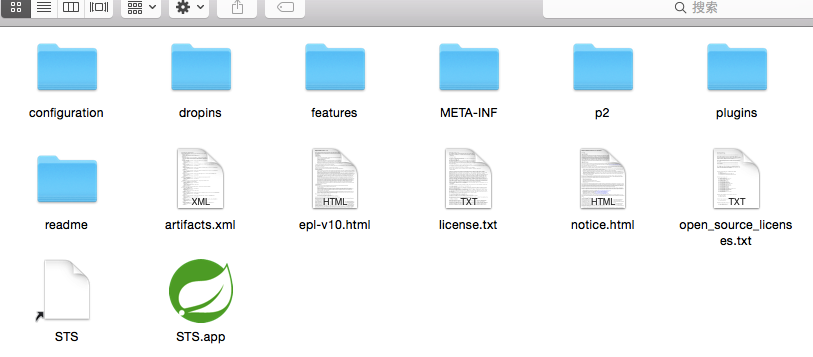

     

        2.将压缩包中的eclipse文件夹拷贝到eclipse的dropins中

     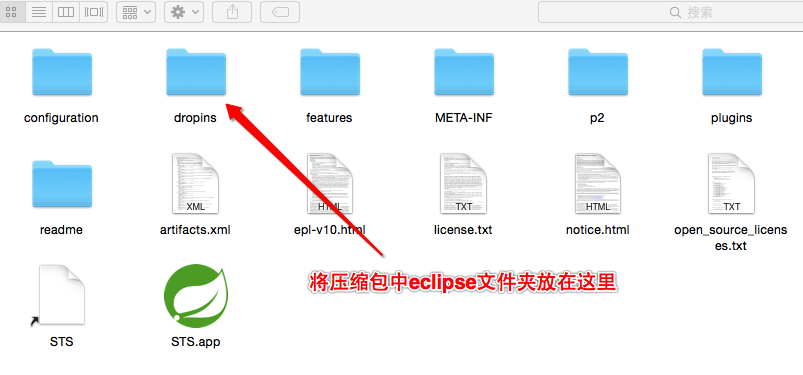
     
     
  		
        3.重启eclipse,打开import视图出现Coverage Sesssion 恭喜你插件安装成功了^ ^

          

---      
   
### 接下来启动要测试项目，这里以cs系统为例
     
  
    1.导入工程到eclipse。

	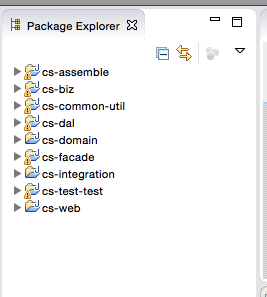    

    2.切换到java工程视图

    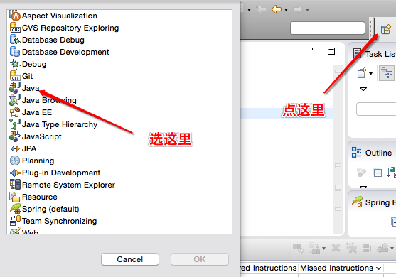  

    3.以覆盖率的方式启动应用，看看下面的图。

    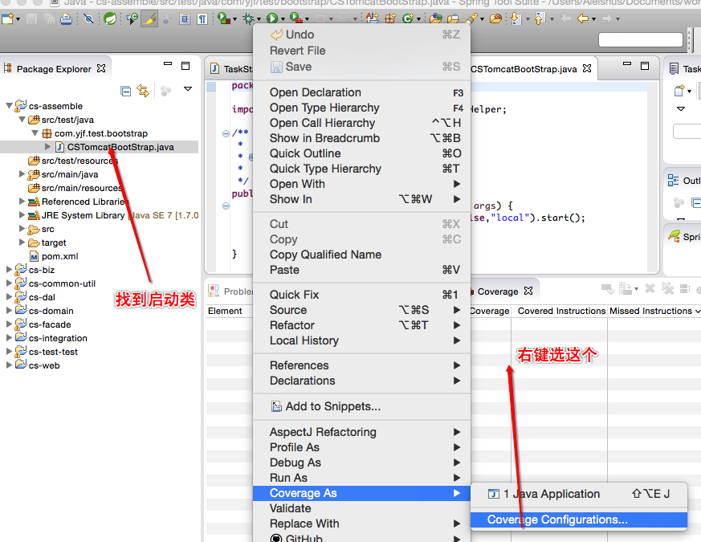  
    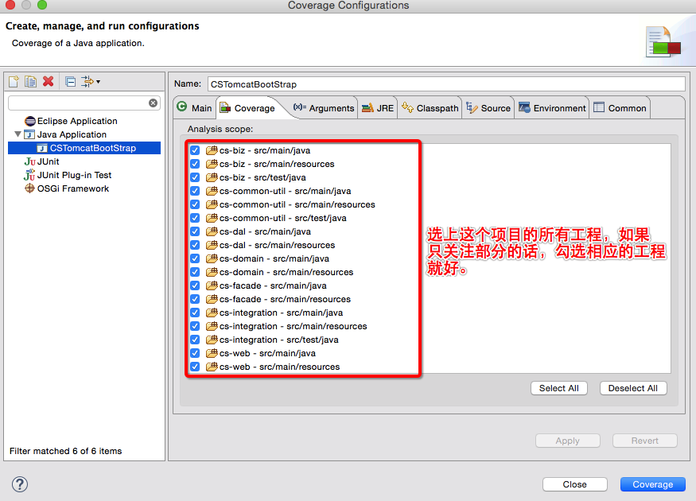
    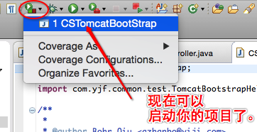

    

    4.现在应用已经启动好了吧，接下就尽情的跑你的测试用例吧，哈哈。    

---
    
### 最后查看代码覆盖率报告

    激动人心的时候就要到啦，你测试用例到底写的好不好，看看覆盖率就知道啦— -
    
    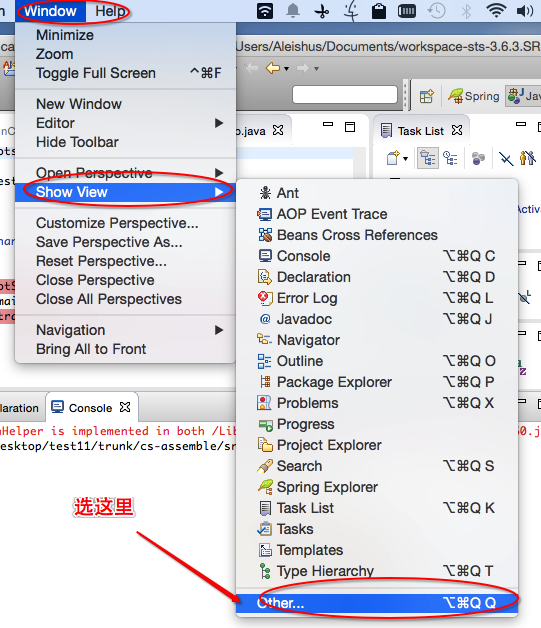

    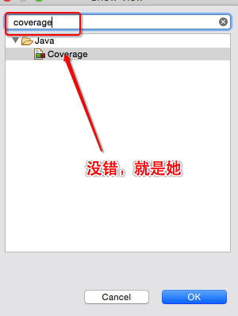

    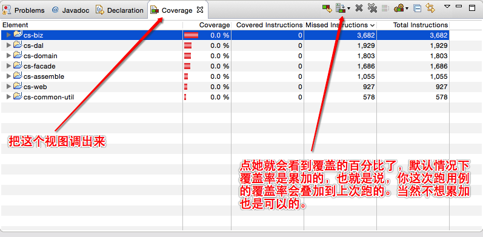

    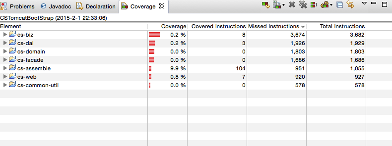

    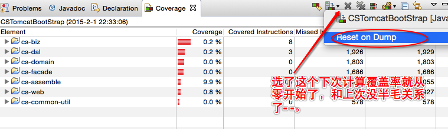

    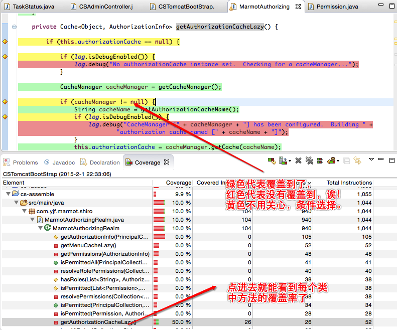
    
    
#### 好了， 到此为止怎样使用eclipse插件查看测试用例代码覆盖率的方法已经完了，你已经学会了吧，如果还有兴趣的话看看下面的提高篇把。

    

2.使用maven命令方式（提高篇）
-----------------
该方式支持远程部署，远程测试，配置定时生成覆盖率报告等。

---
### 添加maven的vm参数 （MAVEN_OPTS）

	    -javaagent:/Users/Aleishus/Desktop/coverage/jacocoagent.jar=includes=com.yjf.cs.*:com.yjf.paycore.*,output=tcpserver,address=*,port=12345

说明：

`/Users/Aleishus/Desktop/coverage/jacocoagent.jar` ->将压缩包中jacocoagent.jar放到任意位置，并配置绝对路径

`includes=com.yjf.cs.*:com.yjf.paycore.*` ->配置你要覆盖测试的classes，多个用冒号隔开

`output=tcpserver,address=*,port=12345` -> 需要用于连接的ip和端口地址，通常只需要配置port就好了

### 通过maven插件启动你的应用

		mvn clean tomcat7:run -Dspring.profiles.active=local -Dmaven.test.skip=true 
 
启动好之后你就可以正常的跑你的测试用例了

---
### 生成覆盖率报告

1.编程方式生成html形式的报告

   下载maven依赖  	

   		<dependency>
  		  <groupId>com.yiji.framework</groupId>
  		  <artifactId>RemoteCoverage-Report</artifactId>
  		  <version>0.0.1</version>
		</dependency>

   代码	(使用前请在项目中使用`mvn compile` 生成class文件,编译的jdk版本要和远程启动应用的jdk版本一致)

		public class ReportTest {

    		public static void main(String... args) throws IOException {
       			 String address = "localhost:12345" ; //vm 参数中配置端口地址
        		 String dumpFile = "/Users/Aleishus/jacoco/accounttrans-dump" ;  //从远程虚拟机中dump代码覆盖率文件
        		 String reportBaseDir = "/Users/Aleishus/jacoco/report" ; //生成报告存放的路径
                 String projectBaseDir = "/Users/Aleishus/Desktop/trunk/" ; //你测试的应用的源代码地址
                CoverageReportGenerator generator = new CoverageReportGenerator(address,dumpFile
                ,reportBaseDir,projectBaseDir) ;
                generator.generateCoveragReport(false); //如果为true覆盖率不会被累加
    		}
		}

执行之后就可以生成报告了，如下图：

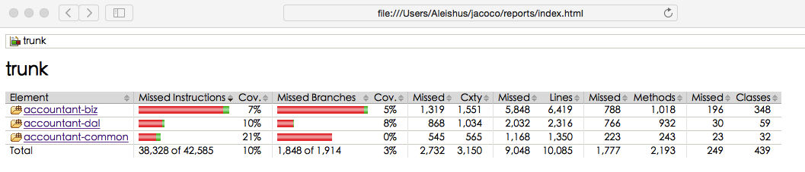	

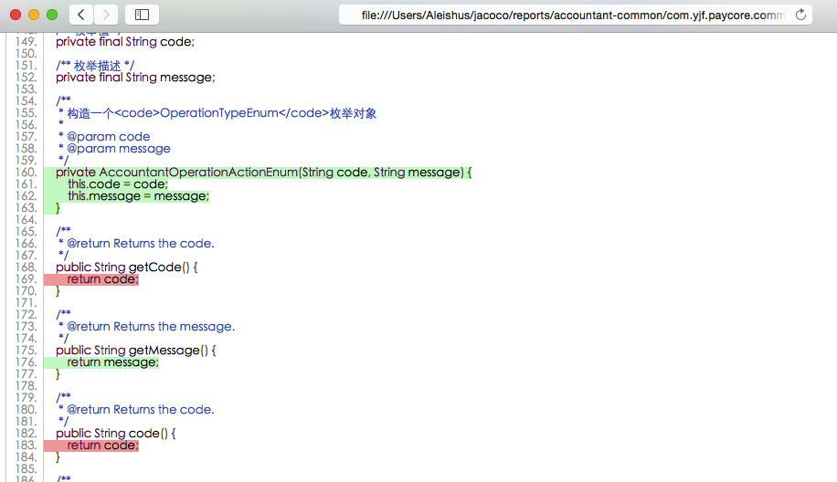

2.在elipse中查看报告
 
 也可以利用eclipse插件来查看远程覆盖率报告(按照基础篇安装插件)，具体方式如下：

---
### 替换maven-compile-plugin （eclipse使用编译器是ecj不是javac，两者编译出来class是有区别的）这里我们统一使用eclipse的编译器，把原来的maven编译插件替换成如下：
 		
 		 <plugin>
         <groupId>org.apache.maven.plugins</groupId>
         <artifactId>maven-compiler-plugin</artifactId>
         <version>3.2</version>
         <configuration>
            <compilerId>eclipse</compilerId>
            <source>1.7</source>
            <target>1.7</target>
            <encoding>UTF-8</encoding>
         </configuration>
         <dependencies>
            <dependency>
                <groupId>org.codehaus.plexus</groupId>
                <artifactId>plexus-compiler-eclipse</artifactId>
                <version>2.2</version>
            </dependency>
         </dependencies>
    	 </plugin>
    	 
  替换之后正常启动，跑你的测试用例吧

---  
### 配置eclispe插件

  首先导入项目正常build，然后
  
  
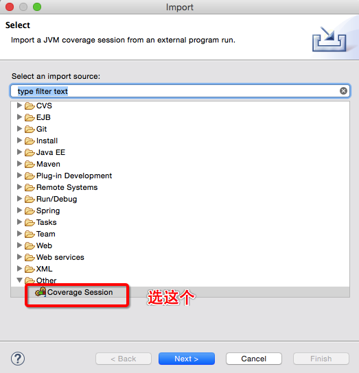

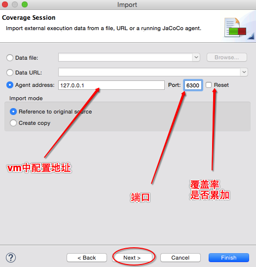    

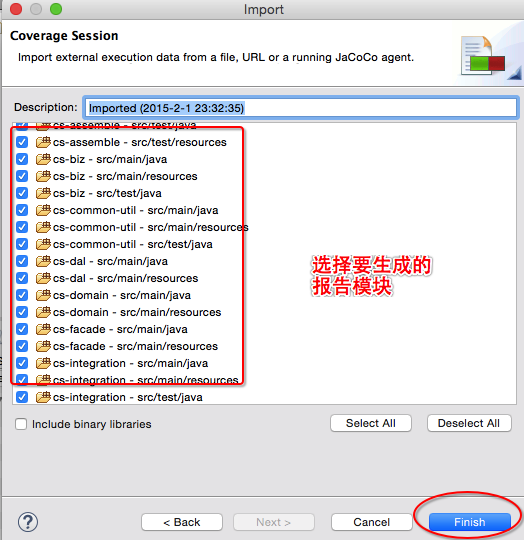

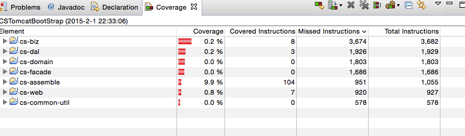

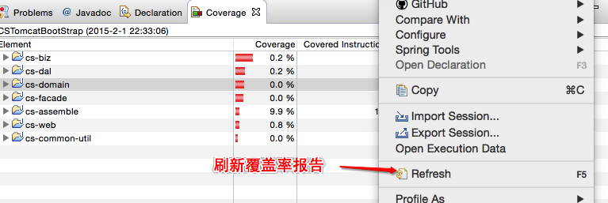

3.存在的问题
--------------------
NULL