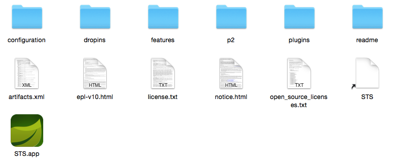
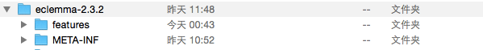
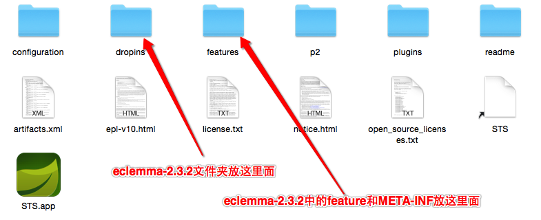
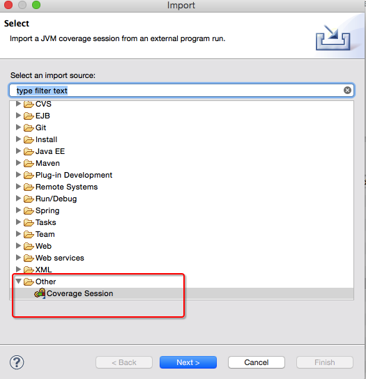

代码覆盖率插件使用
============

1.使用Eclipse插件
-----------------

* 安装插件
		
		1.进入eclispe根目录
  		
     
     

     

        2.将压缩包中的eclemma-2.3.2文件夹拷贝到eclipse的dropins中，将eclemma-2.3.2文件夹中的feature和META-INF文件夹拷贝到eclipse的features目录中

     
     
     
     
  		
      3.重启eclipse,打开import视图出现Coverage Sesssion 表明安装插件成功

     
     
      

2.使用代码的生成报告
=================